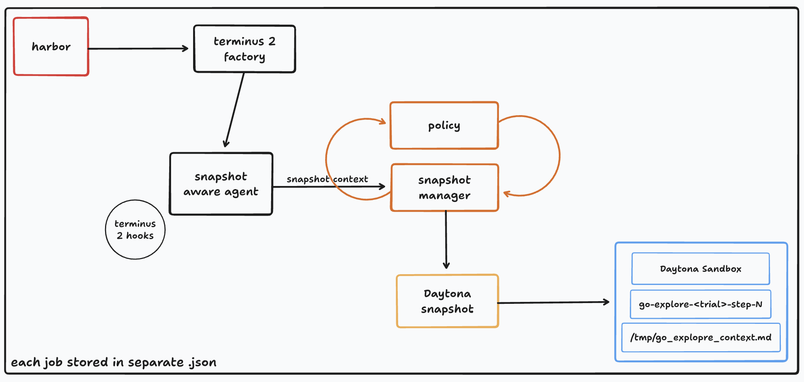
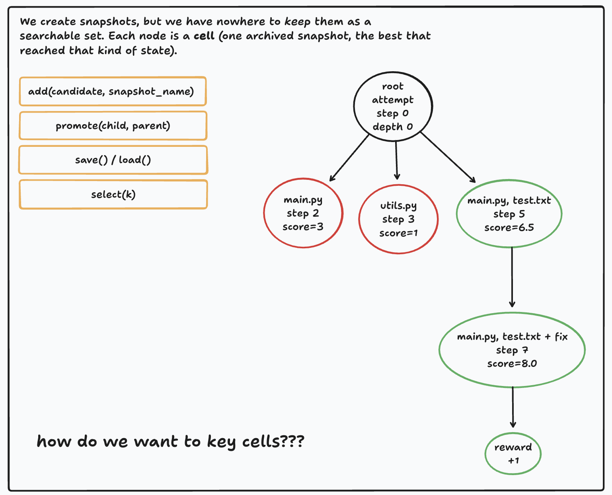
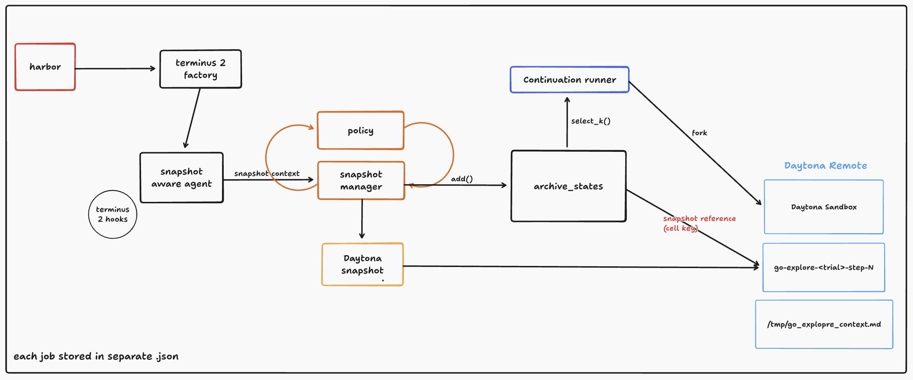

# Go-Explore MVP
- can go-explore search algo be applied to coding agents?
- agent gets a task, we set deterministic critera to snapshot, if this agent fails, another agent picks up from selected snapshot and continues the task

# Things We Need
- Agent interface, need a cheap but capable agent to do some work on a task. 
- criteria for snapshotting, we need to define what is a good snapshot and how to select it.
- logic of restoring the snapshot. Use Daytona API + restore / fork feature.
- 3-5 candidate tasks. These could be SWE-bench or TBench tasks.

# MVP Direction

Use Terminal-Bench tasks through Harbor rather than authoring tasks from scratch.

- Terminal-Bench is the task corpus / benchmark.
- Harbor is the runner, task format, agent interface, environment interface, and dataset registry.
- Go-Explore is the experiment layer that decides when to snapshot, which snapshots to keep, and where to fork continuation attempts.
- Daytona is the first target environment backend for restore / fork behavior.

Keep Terminal-Bench or Harbor checkouts as sibling repos, not nested in this repo, unless we intentionally vendor a fork later.

```text
projects/
  go-explore/
  terminal-bench/
```

# Pipeline: How It Works, And Where It's Going

## How a run works today

A snapshot-aware run happens inside a single process. Harbor loads our factory,
which wraps Terminus-2 in the snapshot-aware agent. As the agent works, the
wrapper hooks its command execution and hands each step to the snapshot manager,
which asks the policy whether the step is interesting and, if so, tells the
Daytona backend to freeze the sandbox as `go-explore-<trial>-step-N`.

This is **one-way**: we create snapshots, but nothing keeps or ranks them.


## The gap: nowhere to keep snapshots

We create snapshots but have nowhere to keep them as a *searchable* set.
Go-Explore needs an **archive**: a map from a **cell** (a descriptor of "what
kind of state is this") to the best snapshot that reached it. Picture it as a
search tree: exploring adds cells, selection forks the promising ones, until a
branch solves the task. The open design question is **how to key cells**?




## Where it's going: archive + continuation

The proposal adds **two boxes** to the pipeline above. The snapshot manager also
calls `add()` into `archive_states`, and a
**continuation runner** reads `select_k()` from the archive to fork the best
cells back into fresh Daytona sandboxes. That closes the loop: the manager
*fills* the archive, the continuation runner *drains* it.


# First Experiment

Start with oracle and baseline Harbor runs before adding branching.

1. Confirm Harbor can run selected Terminal-Bench tasks locally or from the registry.
2. Run oracle attempts to understand task shape, job outputs, traces, and verification data.
3. Identify where Harbor exposes useful per-turn, per-command, or per-test hooks.
4. Add the thinnest adapter needed for deterministic snapshot events.
5. Compare independent attempts from scratch against continuations from selected snapshots.

# Baseline Comparison

For each selected task, compare:

- `N` independent attempts from the initial environment.
- `1` initial attempt plus `N - 1` continuations from selected snapshots.

Track:

- pass / fail,
- cost or token budget,
- wall-clock time,
- best validation result,
- selected snapshot metadata.

# Initial Snapshot Events

The first snapshot policy should be deterministic and simple:

- after an agent command,
- after a file edit,
- after a test or verification command,
- before timeout or failed completion,
- after any Harbor trace event that already contains reward or verifier output.

Selection starts heuristic-based:

- prefer passing or improved validation,
- prefer snapshots with relevant file changes,
- prefer snapshots after useful discovery commands,
- penalize large unrelated diffs,
- penalize missing verifier signal.

# Local Commands

Print the first oracle smoke command:

```bash
python -m go_explore.cli oracle-run --dataset terminal-bench-sample@2.0 --n-tasks 1 --n-concurrent 1 --job-name oracle-smoke
```

Summarize a Harbor job:

```bash
python -m go_explore.cli summarize-job jobs/oracle-smoke
```

List locally cached Harbor tasks:

```bash
python -m go_explore.cli list-cached-tasks
```

See `docs/task-selection.md` for the initial Terminal-Bench task shortlist and current runtime findings.

# Tests

Unit tests run by default:

```bash
uv run pytest -v
```

E2E tests invoke Harbor, Docker, Daytona, or model APIs and are skipped by default. Run them explicitly with either:

```bash
uv run pytest -k e2e -s
uv run pytest --run-e2e -s
```

# Possible Components
- Task Adapter: load task from T-bench. Prep env. run validation
- Agent Runner: give agent task prompt, let it act for a bounded budget.
- record transcript, commands, diffs, test results.
- Snapshot Manager: snapshot env at determinstic points, store snapshot, restore snapshot. Store metadata. 
- Snapshot Selector: start with heuristic ranking, choose top K. Build to interface, so can be replaced with a learned model, or FM.
- Explorer loop: run initial attempt. If fail, fork from selected snpashot and continue. Repeat until success or budget exhausted.

# Clean Code Practices
- google style commit messages.
"""Add projected token accounting to scheduler.

The scheduler previously admitted multiple long requests based only on
current token usage, which could overfill the batch after generation began.

Track projected token usage before admission so waiting requests remain
queued until capacity is available.

Tested:
- pytest tests/test_scheduler.py"""

# Running Experiment Commands
```bash
  set -a; source .env; set +a; export PYTHONPATH="$PWD${PYTHONPATH:+:$PYTHONPATH}"; harbor run --env daytona --jobs-dir jobs --n-attempts 1 --n-concurrent 1 --dataset terminal-bench@2.0 --model anthropic/claude-haiku-4-5-20251001
    │ --include-task-name build-cython-ext --job-name snapshot-haiku-build-cython-ext --export-traces --agent go_explore.agents.factory:SnapshotAwareTerminus2
```

# Project Management

Use `tasks/` as the execution layer:

- `tasks/backlog.md` is the source of truth for task status.
- `tasks/template.md` is the template for new tickets.
- `tasks/phase-1/` contains the current intern-sized tickets.
- `tasks/research-questions.md` holds open research questions that are not yet executable tickets.

Use `docs/` for durable design notes, runbooks, experiment writeups, and result memos.
